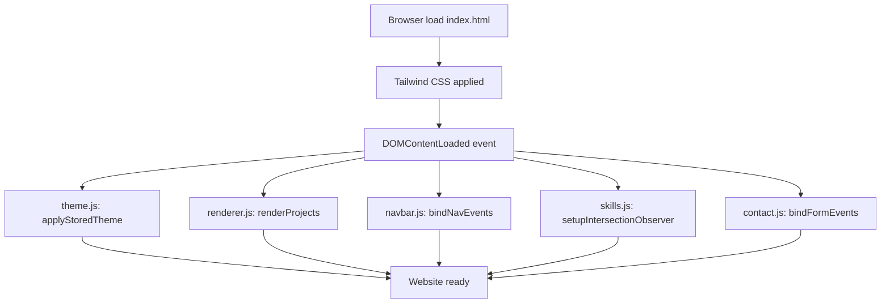
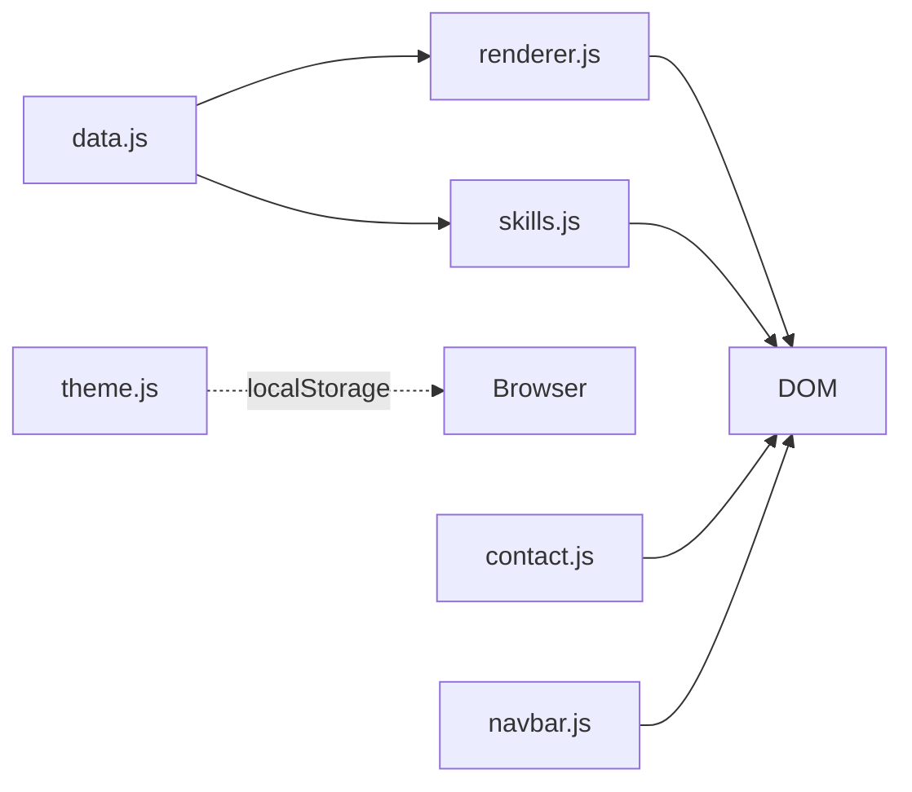

# Design Document: Portfolio Website

## Overview

Dokumen ini mendeskripsikan arsitektur teknis dan desain implementasi untuk website portofolio personal yang dibangun dengan **HTML5**, **Tailwind CSS**, dan **Vanilla JavaScript** — tanpa framework atau build step yang wajib. Website ini bersifat client-side entirely, berjalan langsung di browser, dan dapat di-host sebagai static files.

### Tujuan Desain

- **Zero dependencies runtime**: tidak ada npm, bundler, atau framework JavaScript.
- **Data-driven rendering**: proyek dan skills disimpan dalam array JavaScript terpisah, bukan di-hardcode di HTML.
- **Progressive enhancement**: fungsionalitas dasar bekerja tanpa animasi; animasi adalah lapisan tambahan.
- **Persistent user preferences**: tema tersimpan di `localStorage` dan dipulihkan saat halaman dimuat.

---

## Architecture

Website ini merupakan **Single Page Application sederhana** yang terdiri dari satu file HTML utama, file CSS (Tailwind CDN atau output build), dan beberapa modul JavaScript yang terpisah secara logis.

### Struktur File

```
portfolio-website/
├── index.html              # Shell HTML utama + semua section markup
├── css/
│   └── styles.css          # Tailwind directives + custom CSS (animasi)
├── js/
│   ├── data.js             # Project_Data dan Skills_Data arrays
│   ├── navbar.js           # Logika hamburger menu dan scroll
│   ├── renderer.js         # Renderer: Project_Card generator
│   ├── skills.js           # Progress bar animation + IntersectionObserver
│   ├── contact.js          # Validator dan form submit handler
│   └── theme.js            # Dark mode toggle + LocalStorage
└── assets/
    └── images/             # Foto profil dan thumbnail proyek
```

### Alur Inisialisasi



Semua modul JavaScript diinisialisasi saat `DOMContentLoaded` terpicu. Urutan `applyStoredTheme` dijalankan **pertama** untuk menghindari flash of unstyled content (FOUC) pada preferensi dark mode.

### Module Dependencies



`data.js` adalah satu-satunya modul yang diimpor oleh modul lain. Semua modul lain bersifat independen satu sama lain.

---

## Components and Interfaces

### 1. Navbar

**File**: `js/navbar.js`

**Responsibilities**:
- Toggle visibilitas mobile menu (menambah/hapus kelas CSS)
- Bind event listener pada tautan navigasi untuk smooth scroll
- Menutup menu mobile saat tautan diklik

**Interface**:

```javascript
/**
 * Initializes all navbar behavior.
 * Called once on DOMContentLoaded.
 */
function initNavbar(): void

/**
 * Toggles the mobile menu open/closed state.
 * Mutates DOM by adding/removing 'hidden' class on the menu element.
 */
function toggleMobileMenu(): void

/**
 * Closes the mobile menu.
 * Called when a nav link inside the mobile menu is clicked.
 */
function closeMobileMenu(): void

/**
 * Scrolls smoothly to a target section.
 * Falls back to regular scroll if smooth scroll is unsupported.
 * @param targetId - The id attribute of the target section element
 */
function scrollToSection(targetId: string): void
```

**State**:
- `isMenuOpen: boolean` — status visibilitas mobile menu, direpresentasikan oleh ada/tidaknya class `hidden` pada elemen menu container.

---

### 2. Hero Section

**File**: `index.html` (markup statis) + `css/styles.css` (animasi)

**Responsibilities**:
- Menampilkan konten profil (nama, tagline, deskripsi, CTA)
- Menjalankan animasi fade-in dengan stagger delay via CSS `animation-delay`
- Menjalankan typing effect via CSS animation atau JS character-by-character loop

**Animasi Strategy**:

Animasi menggunakan kombinasi CSS `@keyframes` dan `animation-delay` untuk stagger effect, bukan JavaScript `setTimeout`. Ini mengurangi kompleksitas JS dan memanfaatkan GPU acceleration.

```css
@keyframes fadeInUp {
  from { opacity: 0; transform: translateY(20px); }
  to   { opacity: 1; transform: translateY(0); }
}

.animate-fade-in { animation: fadeInUp 0.6s ease-out forwards; }
.delay-200       { animation-delay: 200ms; }
.delay-400       { animation-delay: 400ms; }
.delay-600       { animation-delay: 600ms; }
```

Typing effect menggunakan CSS `@keyframes` steps() atau JavaScript sederhana dengan `setInterval`:

```javascript
function typeText(element, text, speed = 80) {
  let i = 0;
  element.textContent = '';
  const timer = setInterval(() => {
    element.textContent += text[i++];
    if (i >= text.length) clearInterval(timer);
  }, speed);
}
```

---

### 3. Project Renderer

**File**: `js/renderer.js` dan `js/data.js`

**Responsibilities**:
- Membaca `PROJECT_DATA` dari `data.js`
- Menghasilkan HTML string untuk setiap project object
- Menyisipkan cards ke dalam container DOM
- Menyembunyikan tautan yang tidak tersedia (null/empty)

**Interface**:

```javascript
/**
 * Renders all project cards from PROJECT_DATA into the DOM.
 * @param containerId - ID of the container element to render into
 */
function renderProjects(containerId: string): void

/**
 * Creates the HTML string for a single project card.
 * @param project - A ProjectData object
 * @returns HTML string for the card
 */
function createProjectCard(project: ProjectData): string
```

**ProjectData shape** (lihat Data Models).

---

### 4. Skills Section

**File**: `js/skills.js`

**Responsibilities**:
- Membaca `SKILLS_DATA` dari `data.js`
- Render skills yang dikelompokkan berdasarkan kategori
- Setup `IntersectionObserver` untuk trigger animasi progress bar saat masuk viewport
- Animasi progress bar dari 0% ke nilai target

**Interface**:

```javascript
/**
 * Initializes skills section rendering and scroll animation.
 * @param containerId - ID of the skills container element
 */
function initSkills(containerId: string): void

/**
 * Animates a progress bar element to its target percentage.
 * @param barElement - The inner fill element of the progress bar
 * @param targetPercent - Target width percentage (0-100)
 */
function animateProgressBar(barElement: HTMLElement, targetPercent: number): void
```

---

### 5. Contact Form Validator

**File**: `js/contact.js`

**Responsibilities**:
- Bind submit handler pada form
- Validasi semua field saat submit
- Tampilkan/hapus pesan error per field
- Tampilkan pesan sukses dan reset form setelah submit valid
- Disable/enable tombol submit selama validasi

**Interface**:

```javascript
/**
 * Initializes contact form event bindings.
 */
function initContactForm(): void

/**
 * Validates all form fields.
 * @param formData - Object containing form field values
 * @returns Object with isValid flag and fieldErrors map
 */
function validateForm(formData: FormData): ValidationResult

/**
 * Validates an email string.
 * @param email - The email string to validate
 * @returns true if email contains '@' and a valid domain part
 */
function isValidEmail(email: string): boolean

/**
 * Displays an error message below a field.
 * @param fieldId - The ID of the form field
 * @param message - Error message string to display
 */
function showError(fieldId: string, message: string): void

/**
 * Clears the error message for a field.
 * @param fieldId - The ID of the form field
 */
function clearError(fieldId: string): void
```

---

### 6. Theme Toggle

**File**: `js/theme.js`

**Responsibilities**:
- Membaca preferensi tema dari `localStorage` saat halaman dimuat
- Menerapkan tema ke elemen `<html>` via class `dark`
- Toggle tema saat tombol diklik
- Menyimpan preferensi ke `localStorage`
- Memperbarui ikon toggle sesuai tema aktif

**Interface**:

```javascript
/**
 * Applies the stored theme from localStorage on page load.
 * Falls back to 'light' if no preference is stored.
 */
function applyStoredTheme(): void

/**
 * Toggles the current theme between 'light' and 'dark'.
 * Persists the new theme to localStorage.
 */
function toggleTheme(): void

/**
 * Gets the currently active theme.
 * @returns 'dark' or 'light'
 */
function getCurrentTheme(): 'dark' | 'light'

/**
 * Updates the toggle button icon based on the active theme.
 * @param theme - The current active theme
 */
function updateToggleIcon(theme: string): void
```

**Tailwind Dark Mode**: Konfigurasi menggunakan `darkMode: 'class'` di Tailwind config sehingga class `dark` pada `<html>` mengaktifkan semua `dark:` variant.

---

## Data Models

### ProjectData

```javascript
/**
 * @typedef {Object} ProjectData
 * @property {string}   title        - Judul proyek
 * @property {string}   description  - Deskripsi singkat proyek
 * @property {string[]} technologies - Daftar teknologi yang digunakan
 * @property {string|null} liveUrl   - URL live demo; null jika tidak tersedia
 * @property {string|null} repoUrl   - URL repositori; null jika tidak tersedia
 */

// Contoh Project_Data array (js/data.js)
const PROJECT_DATA = [
  {
    title: "E-Commerce App",
    description: "Aplikasi belanja online dengan fitur cart dan checkout.",
    technologies: ["React", "Node.js", "MongoDB"],
    liveUrl: "https://example.com/demo",
    repoUrl: "https://github.com/user/ecommerce"
  },
  {
    title: "Weather Dashboard",
    description: "Dashboard cuaca real-time menggunakan OpenWeather API.",
    technologies: ["JavaScript", "Tailwind CSS", "REST API"],
    liveUrl: null,
    repoUrl: "https://github.com/user/weather"
  }
];
```

### SkillData

```javascript
/**
 * @typedef {Object} SkillData
 * @property {string} name       - Nama keahlian
 * @property {number} level      - Tingkat kemahiran (0-100)
 * @property {string} category   - Kategori keahlian (Frontend, Backend, Tools, dll.)
 */

// Contoh Skills_Data array (js/data.js)
const SKILLS_DATA = [
  { name: "HTML5",       level: 90, category: "Frontend" },
  { name: "CSS3",        level: 85, category: "Frontend" },
  { name: "JavaScript",  level: 80, category: "Frontend" },
  { name: "Tailwind CSS",level: 75, category: "Frontend" },
  { name: "Node.js",     level: 65, category: "Backend"  },
  { name: "Git",         level: 80, category: "Tools"    }
];
```

### ValidationResult

```javascript
/**
 * @typedef {Object} ValidationResult
 * @property {boolean} isValid   - true jika semua field valid
 * @property {Object}  errors    - Map dari fieldId ke pesan error (kosong jika valid)
 */

// Contoh
const result = {
  isValid: false,
  errors: {
    email: "Email tidak valid",
    message: "Pesan tidak boleh kosong"
  }
};
```

### ThemeValue

```javascript
/**
 * @typedef {'light' | 'dark'} ThemeValue
 * Nilai yang valid untuk key 'theme' di localStorage
 */
```

---

## Correctness Properties

*A property is a characteristic or behavior that should hold true across all valid executions of a system — essentially, a formal statement about what the system should do. Properties serve as the bridge between human-readable specifications and machine-verifiable correctness guarantees.*

### Reflection: Konsolidasi Properti

Sebelum menulis properti final, dilakukan refleksi untuk menghindari redundansi:

- Kriteria 1.3 (buka menu) dan 1.4 (tutup menu) digabungkan menjadi satu round-trip property.
- Kriteria 3.1, 3.2, dan 3.3 (rendering data, jumlah card, isi card) digabungkan menjadi satu comprehensive rendering property karena saling menyiratkan.
- Kriteria 3.4 dan 3.5 (optional URL) digabungkan karena pola tesnya identik.
- Kriteria 5.3, 5.5, 5.6 (error per field kosong) adalah edge case yang tercakup oleh property validasi 5.2.
- Kriteria 6.2, 6.4, 6.5, 6.7, 6.8 dikonsolidasikan: toggle mengubah tema, localStorage menyimpannya, dan ikon berubah sesuai — ketiganya adalah bagian dari satu workflow yang dapat diuji bersama.
- Kriteria 6.6 (default light) adalah edge case dari 6.5.

---

### Property 1: Hamburger Menu Toggle Round-Trip

*For any* initial state of the mobile menu (open or closed), clicking the hamburger button once should change the state to the opposite, and clicking it again should return it to the original state.

**Validates: Requirements 1.3, 1.4**

---

### Property 2: Project Renderer Faithfully Renders All Data

*For any* array of valid `ProjectData` objects, calling `renderProjects()` should produce exactly N cards in the DOM (where N is the array length), and each card should contain the `title`, `description`, all items in `technologies`, and any non-null URL from `liveUrl` and `repoUrl`.

**Validates: Requirements 3.1, 3.2, 3.3, 3.6**

---

### Property 3: Optional URL Conditional Rendering

*For any* `ProjectData` object where `liveUrl` is `null` or empty string, the rendered card should contain no element linking to a live demo. Likewise, *for any* `ProjectData` where `repoUrl` is `null` or empty string, no repository link element should appear in the rendered card.

**Validates: Requirements 3.4, 3.5**

---

### Property 4: Progress Bar Values Are In Range

*For any* `SkillData` object, the rendered progress bar's width value should be a number in the inclusive range [0, 100], matching the `level` property of the input data.

**Validates: Requirements 4.3**

---

### Property 5: Email Validation Correctness

*For any* string `s`, `isValidEmail(s)` should return `true` if and only if `s` contains the `@` character and a domain part (at least one character after `@` followed by `.` and a TLD). Strings lacking these characteristics should return `false`.

**Validates: Requirements 5.4**

---

### Property 6: Form Validation Rejects Any Incomplete Submission

*For any* combination of form field values where at least one required field (name, email, subject, message) is empty or contains an invalid email, `validateForm()` should return `{ isValid: false }` with a non-empty `errors` object. Conversely, *for any* form state where all fields are non-empty and email is valid, `validateForm()` should return `{ isValid: true, errors: {} }`.

**Validates: Requirements 5.2, 5.3, 5.5, 5.6**

---

### Property 7: Error Cleared on Input

*For any* form field that currently has an active error message displayed, firing an `input` event on that field should result in the error message being removed from the DOM for that specific field.

**Validates: Requirements 5.7**

---

### Property 8: Valid Form Submission Produces Success and Reset

*For any* valid form input (all fields non-empty, email valid), calling the submit handler should: (a) display a success confirmation message, and (b) reset all field values to empty strings.

**Validates: Requirements 5.8**

---

### Property 9: Theme Toggle Persists and Applies Correctly

*For any* initial theme state (`'light'` or `'dark'`), clicking the theme toggle should: (a) switch the active theme to the opposite value, (b) write the new theme value to `localStorage` under key `'theme'`, (c) apply the corresponding CSS class to the `<html>` element, and (d) display the correct icon (☀️ for dark mode, 🌙 for light mode).

Furthermore, calling `applyStoredTheme()` with any value `t` stored in `localStorage['theme']` should apply the same theme `t` to the page.

**Validates: Requirements 6.2, 6.3, 6.4, 6.5, 6.6, 6.7, 6.8**

---

## Error Handling

### JavaScript Runtime Errors

| Skenario | Penanganan |
|---|---|
| `PROJECT_DATA` tidak terdefinisi saat renderer berjalan | Guard check: `if (!Array.isArray(PROJECT_DATA)) return;` dengan console.warn |
| Container DOM tidak ditemukan saat render | Guard check: `if (!container) return;` — silent fail, halaman tetap fungsional |
| `localStorage` tidak tersedia (private browsing) | `try/catch` di setiap operasi localStorage; fallback ke tema default 'light' |
| `IntersectionObserver` tidak didukung browser | Feature detection: `if ('IntersectionObserver' in window)` — jika tidak ada, langsung set progress bar ke nilai target tanpa animasi |
| Animasi CSS tidak didukung | CSS `@supports` dan fallback ke tampilan statis; konten tetap readable |

### Form Validation Error States

Setiap field memiliki elemen error sibling yang tersembunyi secara default:

```html
<div class="form-field">
  <input id="nama" type="text" ... />
  <span id="error-nama" class="error-msg hidden text-red-500 text-sm"></span>
</div>
```

Error ditampilkan dengan menghapus class `hidden` dan mengisi `textContent`. Error dihapus saat event `input` pada field tersebut terpicu.

### Scroll Behavior Fallback

```javascript
function scrollToSection(targetId) {
  const target = document.getElementById(targetId);
  if (!target) return;
  if ('scrollBehavior' in document.documentElement.style) {
    target.scrollIntoView({ behavior: 'smooth' });
  } else {
    target.scrollIntoView(); // fallback: instant scroll
  }
}
```

---

## Testing Strategy

### Pendekatan Dual Testing

Strategi pengujian menggunakan dua lapisan yang saling melengkapi:

1. **Unit Tests (Example-Based)**: Verifikasi perilaku spesifik dengan input konkret, kasus tepi, dan kondisi error.
2. **Property-Based Tests (PBT)**: Verifikasi properti universal yang harus berlaku untuk semua input yang valid melalui input yang digenerate secara acak.

### Library yang Digunakan

- **Unit + PBT**: [fast-check](https://fast-check.io/) — library PBT JavaScript yang matang, berjalan di Node.js tanpa bundler tambahan.
- **Test runner**: [Vitest](https://vitest.dev/) atau [Jest](https://jestjs.io/) — keduanya kompatibel dengan fast-check.
- **DOM testing**: [jsdom](https://github.com/jsdom/jsdom) (termasuk di Vitest/Jest secara default) untuk mengakses/memanipulasi DOM dalam tes.

### Konfigurasi Property Tests

- Minimum **100 iterasi** per property test (default fast-check: 100).
- Setiap property test diberi komentar referensi ke design property.
- Format tag: `Feature: portfolio-website, Property {N}: {property_text}`

```javascript
// Feature: portfolio-website, Property 5: Email Validation Correctness
test('isValidEmail returns true only for valid email strings', () => {
  fc.assert(
    fc.property(fc.emailAddress(), (email) => {
      expect(isValidEmail(email)).toBe(true);
    }),
    { numRuns: 100 }
  );
});
```

### Cakupan Unit Tests

#### navbar.js
- Verifikasi `toggleMobileMenu()` menambah class `hidden` pada menu saat open, dan menghapusnya saat closed.
- Verifikasi `closeMobileMenu()` selalu menghasilkan menu dalam state hidden.
- Verifikasi event listener terpasang pada semua nav links.
- Verifikasi `scrollToSection()` memanggil `scrollIntoView` pada elemen target.

#### renderer.js
- Verifikasi render dengan array kosong menghasilkan container kosong.
- Verifikasi render dengan 1 proyek menghasilkan 1 card.
- Verifikasi card dengan `liveUrl: null` tidak mengandung elemen `<a>` dengan href live.
- Verifikasi card dengan `repoUrl: ""` tidak mengandung elemen `<a>` dengan href repo.

#### contact.js
- Verifikasi tombol submit ter-disable saat validasi dimulai.
- Verifikasi tombol submit ter-enable kembali setelah validasi selesai.
- Verifikasi `showError()` membuat elemen error visible dengan pesan yang tepat.
- Verifikasi `clearError()` menyembunyikan elemen error.

#### theme.js
- Verifikasi `applyStoredTheme()` menerapkan class `dark` saat `localStorage.theme = 'dark'`.
- Verifikasi `applyStoredTheme()` menerapkan tema light (tanpa class `dark`) saat `localStorage.theme` tidak ada.
- Verifikasi ikon toggle berubah saat tema berubah.

### Cakupan Property-Based Tests

| Property | Test Description | fast-check Arbitrary |
|---|---|---|
| P1: Hamburger Toggle Round-Trip | Toggle dua kali = state awal | `fc.boolean()` untuk initial state |
| P2: Renderer Renders All Data | N input → N card, tiap card berisi semua field | `fc.array(fc.record({title: fc.string(), ...}))` |
| P3: Optional URL Conditional | null/empty URL → tidak ada link di card | `fc.option(fc.webUrl())` untuk liveUrl/repoUrl |
| P4: Progress Bar In Range | level [0,100] → bar width [0,100] | `fc.integer({min: 0, max: 100})` |
| P5: Email Validation | Valid email → `isValidEmail()` returns true; invalid → false | `fc.emailAddress()` dan `fc.string()` |
| P6: Form Validates All Fields | Semua kombinasi field kosong/isi | `fc.record({name: fc.option(fc.string()), ...})` |
| P7: Error Cleared on Input | Field dengan error + input event → error hilang | `fc.constantFrom('nama', 'email', 'subjek', 'pesan')` |
| P8: Valid Submit Resets Form | Valid form → success + reset | `fc.record` dengan semua field valid |
| P9: Theme Toggle Persists | Toggle → localStorage + CSS class + ikon benar | `fc.constantFrom('light', 'dark')` |

### Pengujian yang Tidak Menggunakan PBT

Beberapa area tidak menggunakan property-based testing karena sifatnya:

- **CSS animations / visual rendering**: Diverifikasi dengan inspeksi manual dan snapshot test jika diperlukan.
- **IntersectionObserver animation trigger**: Ditest dengan mock `IntersectionObserver` dan 2-3 contoh spesifik.
- **Smooth scroll fallback**: Ditest dengan 2 contoh (dengan dan tanpa `scrollBehavior` support).
- **Hero animation stagger delay**: Diverifikasi dengan inspeksi CSS `animation-delay` values pada elemen target.
